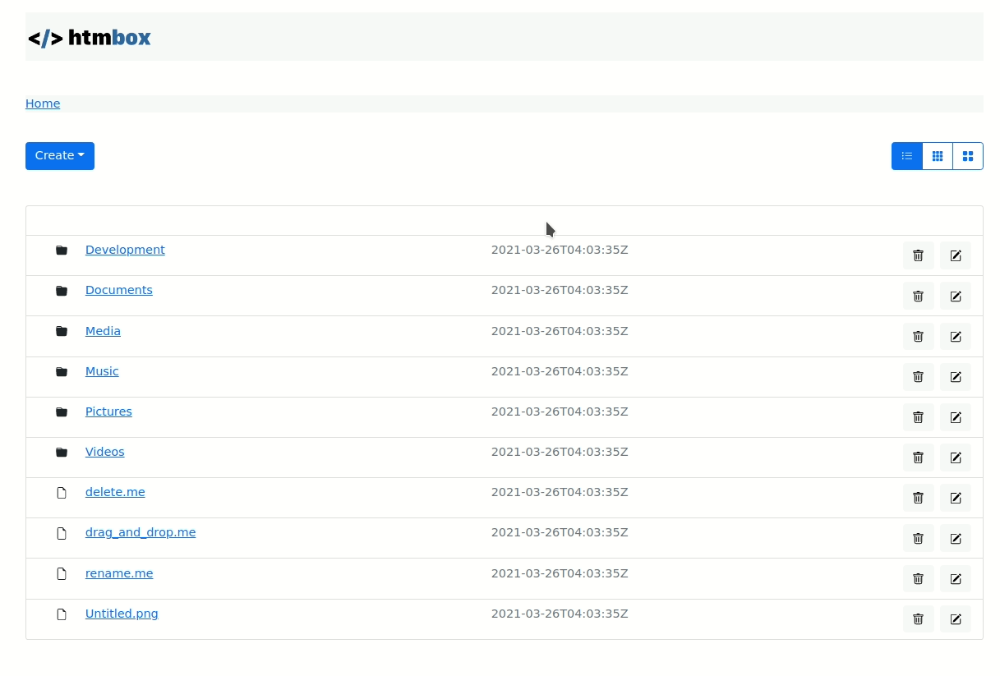

# htmbox

A Dropbox clone in [htmx](https://htmx.org) and [Express.js](https://expressjs.com).

[Demo](https://htmbox.herokuapp.com)


## Local Development
Clone this repo, install dependencies and start the serverf
```
git clone https://github.com/rajasegar/htmx-dropbox
cd htmx-dropbox
npm install
npm start
```

You can view the app in action at `http://localhost:3000`




## Note
There files and folders are not persisted anywhere.

## Inspiration
This project is inspired by the [Dropbox Clone](https://github.com/marcoroth/boxdrop) built with StimulusReflex by [Marco Roth](https://github.com/marcoroth)


